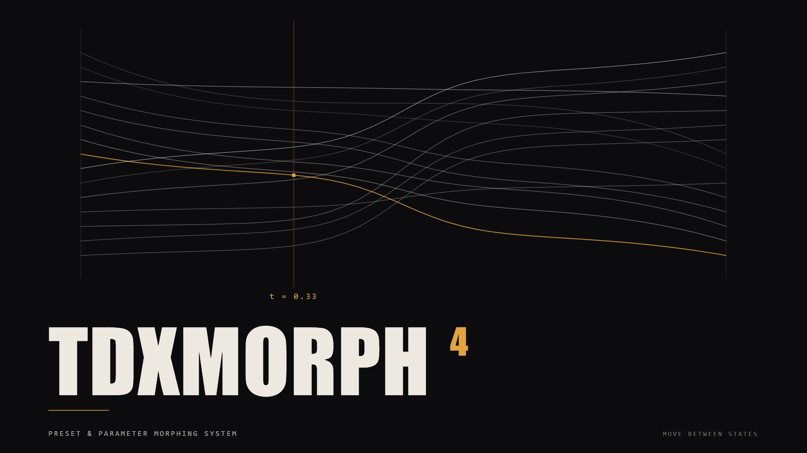
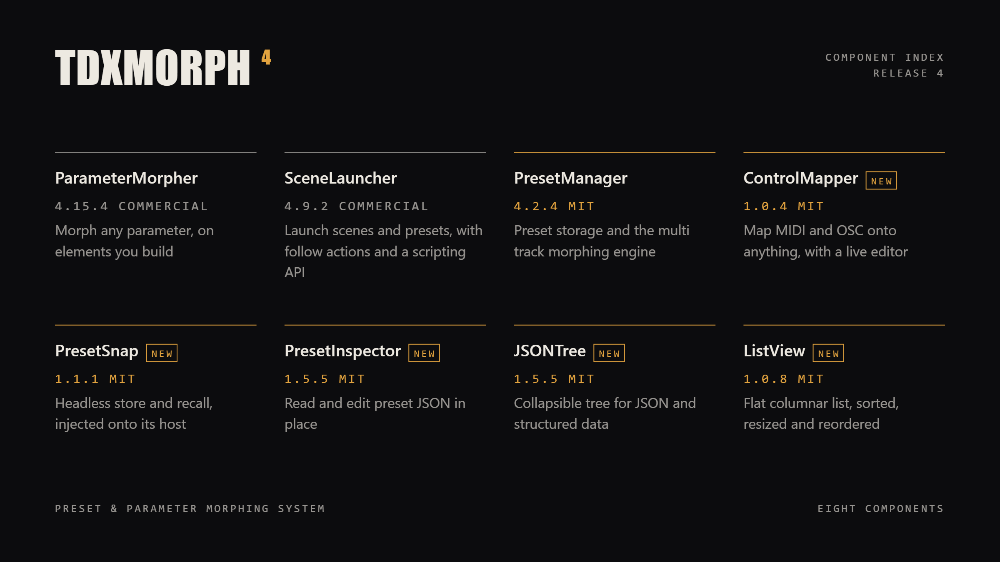
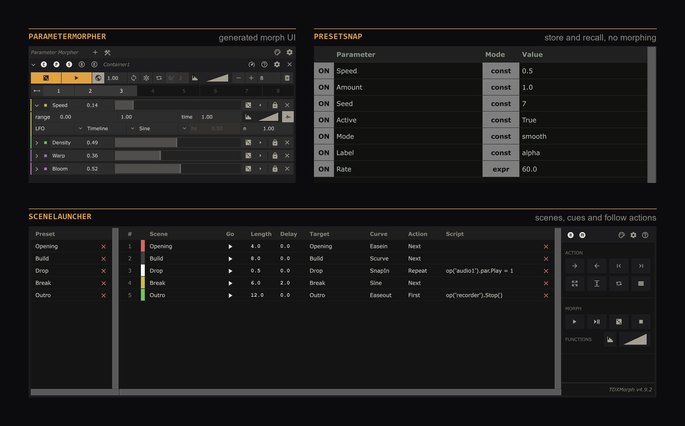

> ### Version 4
>
> Version 4 is a major release comprised of various tools. Each component carries its own version and
> ships on its own schedule, so the [Download](#download) table is the only current list.
>
> The morphing engine was substantially rewritten and the free tier grew from one component to six.
> Presets written by older versions migrate automatically, but **back up your project and export your
> presets before upgrading** from 3.2.1.

## What it is

TDXMorph is a TouchDesigner toolbox for parametric exploration, preset storage, composition and
cueing. Capture the parameter state of any node, morph between states over time, drive it from
generated UIs, and keep it all in a readable JSON format.

It also ships the widgets it is built from, so you can put them in your own systems.

## Start here

Three ways in. Pick the one that matches how you work.

| Component | Shape | What it gives you |
|---|---|---|
| **PresetManager** | No UI, all engine | Manages any number of nodes at once from parameters and Python. The backbone, and where to start if you are building your own system. |
| **ParameterMorpher** | Drag and drop | Drop parameters onto the panel and get a generated UI for morphing, randomizing and exploring. The engine is built in. |
| **SceneLauncher** | Show control | Organize and trigger scenes and presets, with follow actions and cue-based workflow. Attaches a PresetManager that you place yourself. |

## Download

These components are **free and MIT licensed**. Take the folder from this repository, or the build
from [Releases](https://github.com/DarienBrito/TDXMorph/releases).

| Component | Version | What it is |
|---|---|---|
| [**PresetManager**](PresetManager/) | 4.3.0 | Preset storage plus the multi-track morphing engine. The core of TDXMorph. |
| [**PresetSnap**](PresetSnap/) | 1.2.0 | Plain store and recall for any COMP. No morphing, no setup. |
| [**PresetInspector**](PresetInspector/) | 1.5.5 | Preset viewer and value editor. |
| [**JSONTree**](JSONTree/) | 1.5.5 | Reusable JSON tree viewer with inline editing. |
| [**ListView**](ListView/) | 1.0.8 | Reusable flat-columnar list widget. |
| [**ControlMapper**](ControlMapper/) | 1.0.4 | MIDI and OSC mapping for any custom parameter. |

**ParameterMorpher** and **SceneLauncher** are paid components, available through
[Patreon](https://www.patreon.com/c/darienbrito).

## Install

Built and tested on TouchDesigner 2025.33070.

1. Drag the `.tox` into your TouchDesigner network, or use **File > Import > Component**.
2. Click the component's viewer to open its panel.

That is the whole install. Each `.tox` is self-contained and carries everything it needs, so keep it
in your project folder or wherever you keep your components.

Two of them have no panel by design. PresetManager is driven from its parameters and its Python API.
PresetSnap adds a `Presets` page to whatever COMP you drop it into, so storing and recalling are
ordinary parameters and stay MIDI and OSC mappable.

## What you can do

| | |
|---|---|
| **Explore** | Randomly search parameter states across one node or many. Generate patterns programmatically with the *Patterns* library. Build animations automatically out of stored presets. |
| **Morph** | Interpolate between states using a choice of curves, with global timing and per-parameter timing side by side. |
| **Store** | Keep an unlimited number of presets in a readable JSON format, recalled from any node. |
| **Perform** | Cue with follow actions and quantization. Auto-learn MIDI and OSC onto every UI control. |
| **Script** | Drive the whole UI from high-level Python, including algorithmic cueing systems. |

## See it in practice

PresetManager is not in that picture because it has no panel of its own. It is driven from its
parameters and its Python API, which is exactly what makes it the piece you build on.

## Tutorials

The basics are quick to pick up, and there is a lot of depth underneath. The tutorial series covers
both, on [Vimeo](https://vimeo.com/showcase/6682501) and on
[YouTube](https://www.youtube.com/playlist?list=PLVApwo2lw34NfygPlNyqXkV_Zi2HD-hBz).

## Shortcuts

Every shortcut in TDXMorph is <kbd>Shift</kbd> or <kbd>Ctrl</kbd> plus a mouse button. That is the
whole system. Full list in [SHORTCUTS.md](SHORTCUTS.md).

## Documentation

Full reference per component: [PresetManager](Documentation/PresetManager.md) ·
[PresetSnap](Documentation/PresetSnap.md) · [PresetInspector](Documentation/PresetInspector.md) ·
[JSONTree](Documentation/JSONTree.md) · [ListView](Documentation/ListView.md) ·
[ControlMapper](Documentation/ControlMapper.md)

Paid components: [ParameterMorpher](Documentation/ParameterMorpher.md) ·
[SceneLauncher](Documentation/SceneLauncher.md). These are reference pages for products distributed
through Patreon rather than from this repository.

Terse per-class API notes live in [Help](Help/).

## License

Since version 3.2, TDXMorph has been split into free and paid components. The paid side is what funds
the maintenance, the free side and the learning resources.

| | |
|---|---|
| **The six components above** | [MIT](https://opensource.org/license/mit). Use them in personal and commercial projects, modify them freely, redistribute or sell derived works, combine them with closed-source software. You must include the copyright notice and the licence text, and accept that there is no warranty or liability. |
| **ParameterMorpher and SceneLauncher** | Commercial. Licensed, not sold, each governed by its own EULA rather than by MIT: no redistribution, resale, sublicensing or sharing. The terms are in the `LICENSE` operator inside each component. |

Unsure what MIT implies? [Here is a plain explanation](https://memgraph.com/blog/what-is-mit-license).

## Support and feedback

Bugs and suggestions go to the [issue tracker](https://github.com/DarienBrito/TDXMorph/issues). If
you spot something off in the networks, the UI or the code, and you will here and there, I would
really appreciate hearing about it.

You can find me at [darienbrito.com](https://darienbrito.com/) and on
[Instagram](https://www.instagram.com/darien.brito/). If you want to go one step further, my
[Patreon](https://www.patreon.com/c/darienbrito) is where the paid components live and where the
funding for all of this comes from. 💛

This tool exists because of the sense of camaraderie in the TouchDesigner community and the
philosophy of its creators at [Derivative](https://derivative.ca/). I hope it expands what you can
make.

Enjoy!

Darien Brito
